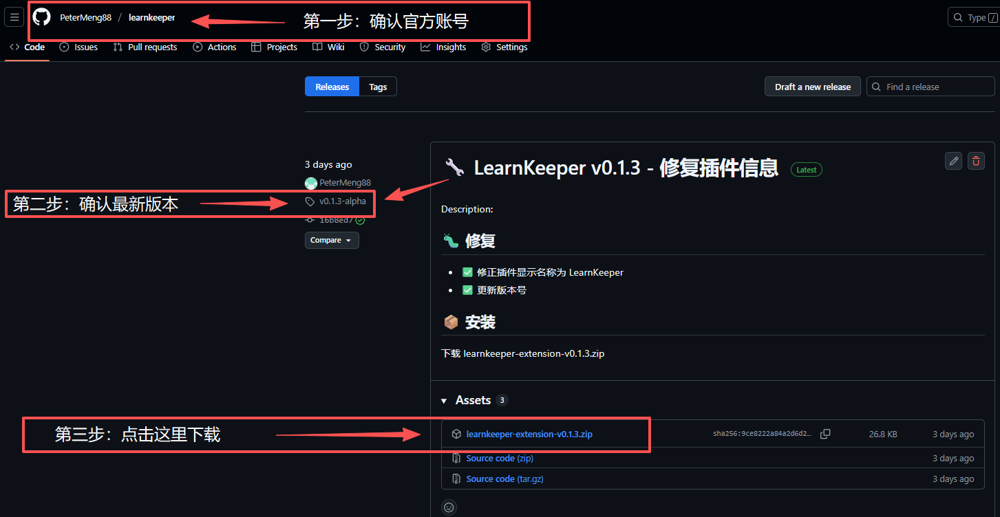
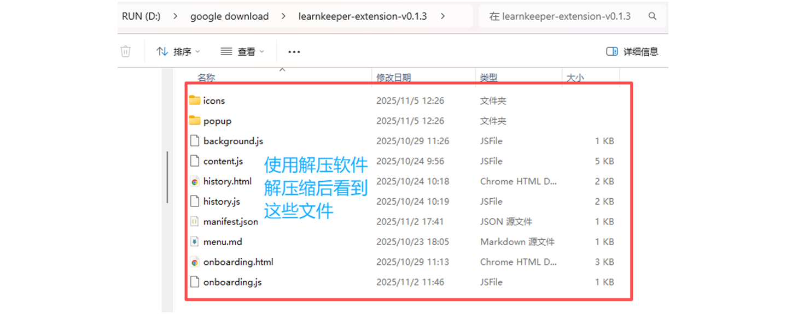
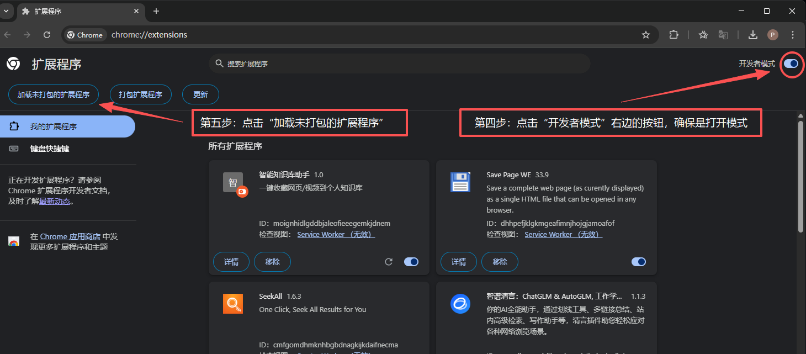
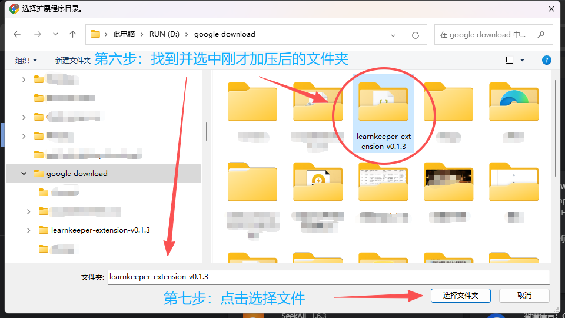
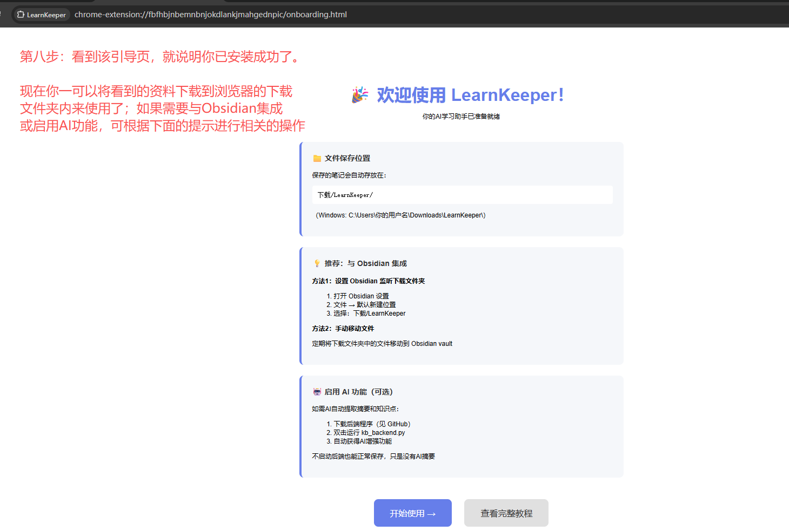

# 安装教程

## 📦 浏览器插件安装

### 第一步：下载插件

1. 访问 [Releases页面](https://github.com/PeterMeng88/learnkeeper/releases)  
2. 找到最新版本
3. 下载 `learnkeeper-extension-vX.X.X.zip`

  

---

### 第二步：解压文件

1. 右键下载的zip文件
2. 选择"全部解压缩"
3. 选择解压位置（建议：桌面）
4. 点击"解压"

  

---

### 第三步：打开Chrome扩展页面

1. 打开Chrome浏览器
2. 地址栏输入：`chrome://extensions/`
3. 按回车

    

---

### 第四步：启用开发者模式

1. 找到右上角的"开发者模式"开关
2. 点击开启（变成蓝色）

    

---

### 第五步：加载插件

1. 点击左上角"加载已解压的扩展程序"
2. 选择刚才解压的文件夹
3. 点击"选择文件夹"

  

---

### 第六步：确认安装成功

✅ 插件列表中出现 LearnKeeper  
✅ 浏览器右上角出现插件图标  
✅ 首次安装会自动打开引导页

  

---

## 🤖 后端安装（可选）

**注意：不安装后端也能正常保存网页，只是没有AI功能**

### 第一步：安装Python

**Windows：**
1. 访问 https://www.python.org/downloads/
2. 下载 Python 3.8+
3. 运行安装包
4. ⚠️ 勾选"Add Python to PATH"
5. 点击"Install Now"

**Mac：**
```
brew install python3
```

**验证安装：**
```
python --version
```

应显示：Python 3.8.x 或更高

---

### 第二步：下载后端代码

**方法1：下载zip**
1. 访问 https://github.com/PeterMeng88/learnkeeper
2. 点击绿色"Code"按钮
3. 选择"Download ZIP"
4. 解压到任意位置

**方法2：使用git**
```
git clone https://github.com/PeterMeng88/learnkeeper.git
```

---

### 第三步：安装依赖

```
cd learnkeeper/backend
pip install -r requirements.txt
```

等待安装完成（约1-2分钟）

---

### 第四步：获取API密钥

1. 访问 https://cloud.siliconflow.cn
2. 注册/登录账号
3. 进入"API密钥"页面
4. 点击"创建新密钥"
5. 复制密钥（sk-开头）

💰 新用户有免费额度

---

### 第五步：配置密钥

1. 找到 `backend` 文件夹中的 `env-example.txt`
2. 重命名为 `.env`
3. 用记事本打开
4. 修改第一行：SILICONFLOWAPIKEY=sk-粘贴你的密钥
5. 保存

---

### 第六步：启动后端
```
python kb_backend.py
```

**成功标志：**
✅ AI功能已启用（硅基流动 - Qwen2.5-7B）
🚀 知识库后端服务启动中...
INFO: Uvicorn running on http://0.0.0.0:800

---

## ✅ 完成！

现在可以：
1. 访问任意网页
2. 点击LearnKeeper图标
3. 保存内容（有后端会自动生成AI摘要）
4. 文件在：下载/LearnKeeper/

---


## 📓 Obsidian集成（推荐）

### 方法1：设置Obsidian仓库位置（最简单）

**步骤：**
1. 打开Obsidian
2. 左下角 设置⚙️ → 文件与链接
3. 找到"新文件的默认位置"
4. 选择"指定文件夹"
5. 输入：`Downloads/LearnKeeper`（相对路径）
6. 或选择完整路径：`C:\Users\你的用户名\Downloads\LearnKeeper`

**效果：**
✅ 保存的文件直接在Obsidian中显示  
✅ 无需手动移动  
✅ 实时同步

  

---

### 方法2：创建Obsidian仓库（推荐高级用户）

**步骤：**
1. Obsidian → 打开另一个仓库 → 打开文件夹作为仓库
2. 选择：`Downloads/LearnKeeper`
3. 打开

**优点：**
- 专门的学习笔记仓库
- 完整的Obsidian功能
- 可以添加插件和主题

---

### 方法3：手动移动文件

**适合场景：**
- 已有Obsidian仓库不想改变
- 需要筛选后再导入

**操作：**
1. 定期打开 `Downloads/LearnKeeper`
2. 选择需要的文件
3. 复制/移动到Obsidian vault

---

### 方法4：自动同步（高级）

**使用FreeFileSync：**  
1. 下载：https://freefilesync.org/
2. 源文件夹：`Downloads/LearnKeeper`
3. 目标文件夹：你的Obsidian vault
4. 设置定时同步（每小时/每天）

**使用Python脚本：**
python
```auto_sync.py```

import shutil
import os
from pathlib import Path

source = Path.home() / "Downloads/LearnKeeper"
target = Path("D:/你的Obsidian仓库/notes")

for file in source.glob("*.md"):
shutil.copy(file, target)
print(f"已同步: {file.name}")


---

## 🎓 Obsidian使用技巧

### 建议工作流：

**1. 保存网页 → 2. 在Obsidian中整理 → 3. 建立知识连接**

### 推荐插件：
- **Dataview**：查询和展示笔记
- **Calendar**：日历视图
- **Excalidraw**：画图
- **Various Complements**：自动补全标签

### 推荐结构：
LearnKeeper/
├── 00-收件箱/ ← 新保存的内容
├── 01-处理中/ ← 正在学习的
├── 02-已完成/ ← 已掌握的
└── 03-归档/ ← 参考资料

---

## ✅ 完成！

现在你的工作流：
1. 浏览网页 → 点击插件保存
2. 打开Obsidian → 文件已在那里
3. 整理、添加笔记、建立链接
4. 用AI对话学习（如果需要）

---

## 🆘 常见问题

**Q: Chrome说"无法加载扩展程序"**  
A: 确认选择的是解压后的文件夹，不是zip文件

**Q: 后端启动失败**  
A: 检查Python版本（需要3.8+）和依赖安装

**Q: 找不到保存的文件**  
A: 在下载文件夹中找 LearnKeeper 子文件夹

下一步：[查看FAQ](FAQ.md) 或 [回到主页](../README.md)


